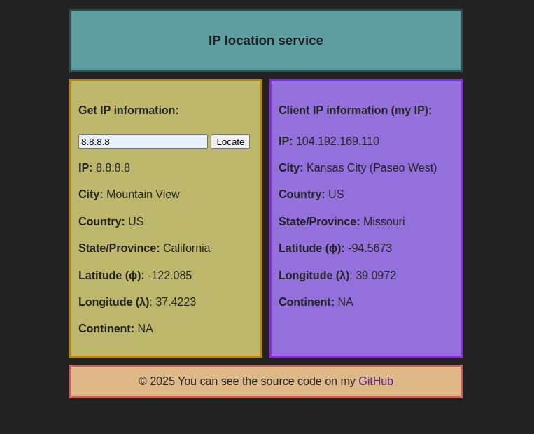

## IP location service frontend
[](https://ip-info.oncook.top)
[](https://github.com/streamdp/ip-info-fe/blob/main/LICENSE)

Simple frontend for the [ip-info](https://github.com/streamdp/ip-info) service written with [htmx](https://htmx.org/). 
Provides information about the client's IP address and also gives you the ability to get
information about any IP address you want.

### Build and run
You could build docker container and run it:
```shell
$ docker build -t static:latest .
$ docker run -it --rm --init -p 80:80 static:latest
```
or use simple compose file, such like that one:
```shell
version: "3.5"
services:
  static:
    build: .
    image: static:latest
    container_name: static
    ports:
      - "80:80"
```
and run this with the following command:
```shell
$ docker-compose up -d
```
### Screenshot

<div style="align-content: center" style="width: 100%">
   
</div>